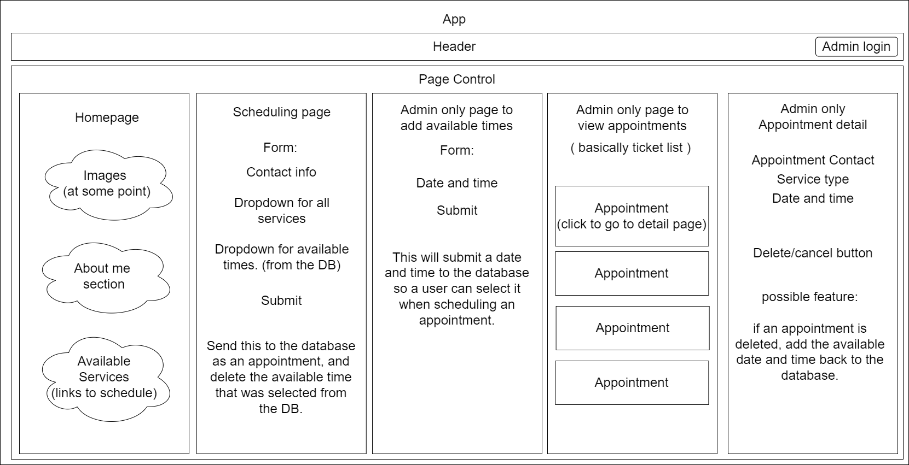

# Skincare & Beauty Services

#### By _**Grace Kostanich**_    

#### A website made for providing skincare and cosmetic services to users. It will give users the ability to schedule & purchase a variety of treatments and services from a licensed esthetician. All bookings and financial processes will be done within the webpage.   
*`Project still in development`*

---

## Description

_This is a React application using styled-components and bootstrap CSS for styling. It uses JavaScript for all functionality, and a cloud-hosted Firestore database._

---

## Technologies Used

```
React
JavaScript
CSS
HTML
Firebase
```

## Setup and Installation Requirements
**⚠️ These Setup instructions assume you have GitBash pre-installed ⚠️**

If needed, please navigate to this link:  
https://git-scm.com/download/  
Download Git and follow the setup wizard. 

**NOTE**: _For security purposes, the actual .env file for this project will not be provided. If you'd like to run this project, see_ [Creating a Firestore Database](#skincare-&-beauty-services---setup)

---

# Skincare & Beauty Services - `Setup`

<details>
<summary><strong>Cloning the Application</strong></summary>
<ol>
<li>Copy the git repository url: https://github.com/User8240/Skincare-and-Beauty-Services.git
<li>Open a GitBash terminal and navigate to your Desktop with <strong>cd</strong> command
<li>Run,  
<strong>$ git clone https://github.com/User8240/Skincare-and-Beauty-Services.git</strong>
<li>In the terminal, navigate into the <em>projects</em> root directory,"skincare-and-beauty-services".
<li>Run,  
<strong>$ npm install</strong>
<br>
</details>

<details>
<summary><strong>Creating a Firestore Database</strong></summary>
<ol>
<li>Navigate to <a href="https://firebase.google.com/">Firebase</a>
<li>Select "Get Started" on the homepage
<li>Sign in with a Google account
<li>Select "Go to console" on the Firebase homepage
<li>Select "Create a Project"
<li>Name the project "skincare-beauty-services" 
<li>Select the checkbox then click continue
<li>Disable Google analytics in this project (it's toggled on by default)
<li>Click "Continue"
<li>On the left-hand menu, click "Build", then select "Firestore Database"
<li>You'll be brought to a page that says "Cloud Firestore". From here, select "Create database"
<li>Select "Start in <strong>test mode</strong>", then hit next
<li>Select Enable
<li>On the left-hand menu bar, select "Project Overview"
<li>On the homepage, underneath "Get started by adding Firebase to app", select the:
<br>
 icon">
<li>For the App nickname, call this "skincare-beauty-services-app" then select "Register app"
<li>Select "Continue to console"
<br>
</details>

<details>
<summary><strong>Connect Database to the Application</strong></summary>
<ol>
<li>Navigate back to your GitBash terminal and make sure you're in the project root directory
<li>Install firebase by running,
<strong>$ npm install firebase@9</strong>
<li>Once installed - <em>in the same directory</em> - run,
<strong>$ touch .env</strong>
<li>Now open the project by running,
<strong>$ code .</strong>
<li>Open the .env file you just created and add the following code:
<pre>
REACT_APP_FIREBASE_API_KEY = 
REACT_APP_FIREBASE_AUTH_DOMAIN = 
REACT_APP_FIREBASE_PROJECT_ID = 
REACT_APP_FIREBASE_STORAGE_BUCKET = 
REACT_APP_FIREBASE_MESSAGING_SENDER_ID = 
REACT_APP_FIREBASE_APP_ID = 
</pre>
<li>Navigate back to Firebase console
<li>On the left-hand menu bar, select the gear icon to the right of "Project Overview"
<li>Select "Project settings" then scroll down the page until you find a script
<li>One by one, go through all the values in this script that match up to the ones we listed in the .env file and paste them after the = sign 
<br>
<small>(NOTE: leave out the "" quotation marks)</small>
<li>Once finished with adding values to the .env file, navigate back to Firebase console
<li>On the left-hand menu bar, click "Build" then select "Authentication"
<li>Select "Get started"
<li>Under "Native providers", select "Email/Password" then click "Save"
<li>Under Authentication there's a few tabs, select the one that says "Users"
<li>In the right hand corner, select "Add user"
<li>Create an account by typing in a working email and a password
<br>
<strong>You're ready to go!</strong>
<br>
</details>

<details>
<summary><strong>Running the Application in Your Browser</strong></summary>
<ol>
<li>After having completed all steps listed above, navigate to the project directory in GitBash Terminal
<li>Run, 
<strong>$ npm run start</strong>

<small>NOTE: When accessing the Admin Portal, which is the sign-in path (```http://localhost:[YOUR-PORT-#]/sign-in```), use the credentials you used to create an authenticated account in Firebase</small>
<br>
</details>

---
## Paths

Note: [YOUR-PORT-#] will be automatically provided by your system when you run the application 

#### Home page URL
```
http://localhost:[YOUR-PORT-#]
```
#### Admin Portal URL
```
http://localhost:[YOUR-PORT-#]/sign-in
```

#### Example URL's
```
http://localhost:3000
http://localhost:3000/sign-in
```


## Project Component Diagram



---
 
This program was built using [Create React App](https://github.com/facebook/create-react-app).
 
---

## Known Bugs

_While signed in, the admin portal will temporarily display the main homepage before checking if an authenticated user is signed in._


> ### Research & Planning Log
> 
> #### Friday, 09/16
> * 8:00: Work on Capstone Proposal
> * 9:00: Come up with possible designs for client
> * 10:00: Continue designing / drawing
> * 11:00: Review React CSS lesson
> * _LUNCH BREAK_
> * 1:00: Find resources on CSS in React
> * 3:00: Watch videos / explore resources found
> * 4:00: Work on README

> #### Friday, 09/23
> * 9:00: Plan necessary components
> * 10:00: Begin component diagram
> * 11:00: Create project | Clean up files
> * 11:30: Update Capstone Proposal with MVP correction
> * _LUNCH BREAK_
> * 1:00: Implement components 
> * 2:00: Update / fix component diagram
> * 4:00: Continue to build out basic component structure 

> #### Friday, 09/30
> * 9:11: Continue adding to basic component structure 
> * 10:11: WIP: Build out controller component
> * 11:04: WIP: Connect Home and Controller components
> * 11:57: WIP: Bugfixing components
> * _LUNCH BREAK_
> * 1:13: Begin adding necessary functions in controller
> * 3:00: Create toggle button
> * 4:04: Add navigation bar & necessary functionality  

> #### Tuesday, 10/4
> * 9:00: Begin to add firebase to project
> * 10:07: WIP: Continue to implement firebase
> * 11:03: WIP: Refactor code to use firebase
> * _LUNCH BREAK_
> * 1:03: BUGFIX: Get data to firebase
> * 2:06: Pull data from firebase
> * 3:20: Setup listener on appointment list
> * 4:11: Begin implementing Admin pages

> #### Wednesday, 10/5
> * 9:06: WIP: Build out Admin components 
> * 10:17: BUGFIX: Continue to build out and bugfix admin components
> * 11:08: Add necessary functionality for all admin components
> * _LUNCH BREAK_
> * 1:15: Continue adding necessary functions to controller
> * 2:12: WIP: Structure the admin components
> * 2:54: Restructure currently visible states if statement for authentication
> * 4:30: WIP: Implement authentication

## License

[MIT](https://opensource.org/osd)

Copyright (c) _9/16/2022_ _Grace Kostanich_
